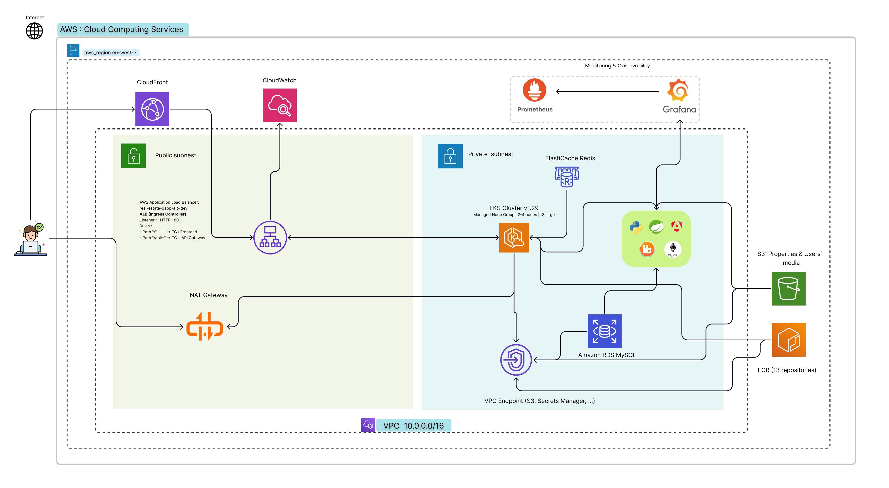
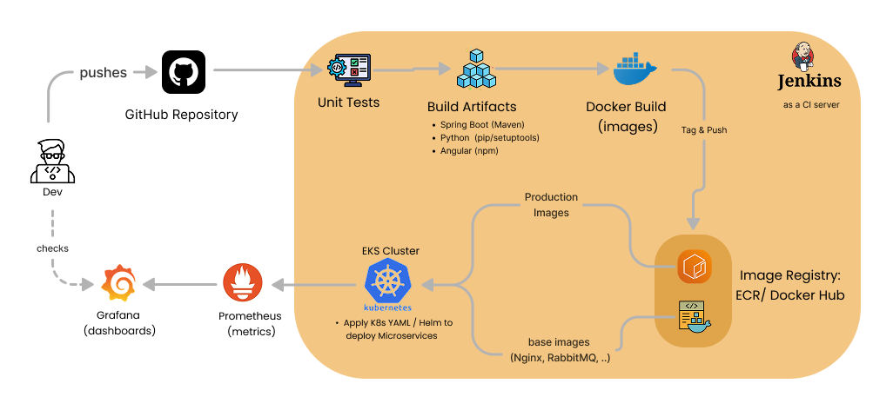

# 🏠 RENTOPIA – Plateforme de Location Web3

Une plateforme Web3 de location immobilière intégrant microservices, blockchain Ethereum et machine learning pour des réservations sécurisées et intelligentes.

[](https://openjdk.java.net/) 
[](https://spring.io/projects/spring-boot)
[](https://angular.io/)
[](https://ethereum.org/)
[](https://fastapi.tiangolo.com/)
[](https://aws.amazon.com/)

---

<p align="center">
  
</p>

---

## 🎯 Fonctionnalités Clés

✅ Auth Web3 (MetaMask) + JWT | ✅ Paiements ETH sécurisés via escrow décentralisé  
✅ Réservations intelligentes (prix automatique) | ✅ Chat temps réel  
✅ 4 modèles IA (prix, risque, recommandations, tendances) | ✅ Notations immuables sur blockchain  
✅ Media S3 + CDN CloudFront | ✅ Dashboard hôte complet

---

## 🏗️ Architecture

```
Frontend (Angular) → API Gateway → 9 Microservices → MySQL + S3 → Ethereum Sepolia
         ↑                                  ↑
         └──────── WebSocket + Notifications ────┘

Infrastructure: Spring Cloud (Eureka, Config, Gateway) | RabbitMQ | Kubernetes | Prometheus/Grafana
```

---

## 👥 Équipe

| Rôle | Nom | Domaines |
|------|-----|----------|
| **Backend** | Bouzid Mina | 9 microservices Spring Boot, MySQL, JWT |
| **Blockchain & AI** | Ikrame Houzane | Smart contracts Solidity, 4 modèles ML, FastAPI |
| **Frontend** | Allali Fatima-ezzahra | Angular 18, Web3, NgRx, Material UI |
| **Cloud** | Azhich Salma | AWS EKS, RDS, S3, CloudFront, Terraform |
| **DevOps** | Kaddar Mohamed Iliass | Docker, Kubernetes, Jenkins CI/CD, Monitoring |

---

## 🔧 Architecture Technique

### 9 Microservices (Ports 8081–8089)

| Service | Responsabilités |
|---------|-----------------|
| **User** | Auth JWT, profils, wallets ETH, rôles |
| **Listing** | Propriétés CRUD, disponibilités, tarifs dynamiques |
| **Booking** | Réservations, calcul prix, états, intégration blockchain |
| **Payment** | Paiements ETH, escrow, Web3j, gas fees |
| **Messaging** | Chat WebSocket temps réel |
| **Notification** | Emails SMTP, alertes RabbitMQ |
| **Review** | Avis, notes (1-5 étoiles), statistiques |
| **Media** | Upload S3, compression, thumbnails, déduplication |
| **Blockchain** | Interaction smart contracts, événements blockchain |

### Infrastructure Spring Cloud

- **Eureka (8761)** : Service Discovery + load balancing
- **Config Server (8888)** : Configuration centralisée
- **API Gateway (8080)** : Routage unique, JWT, rate limiting
- **RabbitMQ** : Communication asynchrone, notifications
- **MySQL 8.0** : Base de données relationnelle
- **Redis** : Cache distribué

---

## 🧠 Intelligence Artificielle

### 4 Modèles ML (FastAPI - Port 8090)

| Modèle | Algorithme | Cas d'usage |
|--------|-----------|-----------|
| **Price Prediction** | GradientBoosting | Suggestion prix optimal en ETH |
| **Risk Scoring** | RandomForest | Évaluation risque locataire (0-100) |
| **Recommendations** | Collaborative Filtering | Propriétés personnalisées |
| **Market Trend** | KMeans Clustering | Tendances par quartier |

**Points forts** : Prédictions <50ms | GridSearchCV optimisé | Swagger auto-documenté | Support batch

---

## ⛓️ Blockchain (Ethereum Sepolia)

### Smart Contract RentalPlatform.sol

**Fonctionnalités principales** :

- 📅 États réservation : PENDING → CONFIRMED → CHECKED_IN → CHECKED_OUT → COMPLETED
- 💰 Escrow sécurisé + frais plateforme 5% (non remboursables)
- 🔒 Prévention double-booking avec vérification dates
- ⭐ Notation immuable (1-5 étoiles, stockée sur blockchain)
- 📋 Politique remboursement : 100% (>7j) | 50% (3-7j) | 0% (<3j)
- 🛡️ ReentrancyGuard, Ownable, Pull pattern, validation stricte

**Événements** : BookingCreated, CheckInCompleted, PaymentReleased, RatingAdded, etc.

### Flux de réservation

```
1. Locataire crée réservation + paie ETH
2. Frais (5%) vont à plateforme, montant reste en escrow
3. Locataire check-in/check-out
4. Admin libère fonds propriétaire après check-out
5. Locataire note propriété (immuable)
```

---

## 🎨 Frontend (Angular 18)

**Stack** : TypeScript | NgRx (State) | Material UI | Ethers.js | Leaflet Maps

### Pages principales

- 🔐 **Auth** : MetaMask, signature message, vérification email
- 🏠 **Listings** : Recherche, filtres, carte interactive
- 📅 **Property Detail** : Galerie, booking, paiement ETH
- 👤 **Host Dashboard** : Gestion propriétés, calendrier, statistiques
- 💬 **Messaging** : Chat temps réel avec notifications
- 👤 **Profile** : Infos utilisateur, avis, langues

---

## ☁️ Cloud & DevOps

<p align="center">
  
  <br/>
  <em>Architecture Cloud AWS : VPC, EKS, RDS, S3, CloudFront, ALB, Monitoring</em>
</p>

### Infrastructure AWS (Terraform)

| Service | Config |
|---------|--------|
| **EKS** | Kubernetes 1.32, node group minimal (1-2 t3.large) |
| **RDS** | MySQL 8.0, db.t4g.micro, single-AZ, backup 1j |
| **S3** | 2 buckets privés, versioning, lifecycle 90j, OAI CloudFront |
| **CloudFront** | CDN global, compression, HTTPS forcé |
| **Jenkins** | CI/CD t3.micro, accès SSM (sécurisé), webhooks GitHub |
| **Monitoring** | CloudWatch dashboards + 2 alarmes (ALB 5XX, CPU RDS) |

### CI/CD Pipeline

<p align="center">
  
  <br/>
  <em>Pipeline DevOps : Git → GitHub → Jenkins → Docker → ECR → Kubernetes → Monitoring</em>
</p>


### Kubernetes Manifests

```
k8s/
├── infra/          # Eureka, MySQL, RabbitMQ, Redis
├── services/       # 11 microservices deployments
├── ingress/        # AWS ALB + routing
├── namespaces/     # dev & prod 
├── monitoring/     # Prometheus + Grafana (kube-prometheus-stack)
└── config/         # ConfigMaps + Secrets
```

**Monitoring** : Prometheus (scrape) + Grafana (dashboards) + alertes actives

---

## 🚀 Déploiement Local

### Docker Compose

```bash
docker-compose up -d

# Frontend: http://localhost:4200
# API Gateway: http://localhost:8080
# Eureka: http://localhost:8761
# AI Service Swagger: http://localhost:8090/docs
```

### Variables d'environnement essentielles

```env
# Blockchain
INFURA_KEY=...
CONTRACT_ADDRESS=0x...
PRIVATE_KEY=...

# Database
DB_URL=jdbc:mysql://mysql:3306/rental_db
DB_USER=root
DB_PASSWORD=...

# JWT
JWT_SECRET=...

# AWS
AWS_ACCESS_KEY_ID=...
AWS_SECRET_ACCESS_KEY=...
AWS_REGION=eu-west-3

# Email (Mailgun/SMTP)
SMTP_HOST=...
SMTP_PORT=587
SMTP_USER=...
SMTP_PASSWORD=...
```

---

## 📊 Stack Technique Complète

| Domaine | Technologies |
|-------|--------------|
| **Backend** | Spring Boot 3.x, Spring Cloud (Gateway, Eureka, Config), JPA/Hibernate, Web3j, RabbitMQ, MySQL, Redis, JWT, BCrypt |
| **Frontend** | Angular 18, TypeScript, NgRx, Angular Material, Ethers.js, Leaflet, WebSocket |
| **IA / Machine Learning** | FastAPI, scikit-learn, XGBoost, pandas, NumPy, matplotlib, Seaborn, Plotly |
| **Blockchain** | Solidity 0.8.20, Hardhat, OpenZeppelin, Ethers.js, Sepolia Testnet |
| **DevOps & Cloud** | Docker, Kubernetes, Helm, Terraform, Jenkins, Prometheus, Grafana, AWS (EKS, RDS, S3, CloudFront, CloudWatch, ECR, SSM, VPC) |


## 🔐 Sécurité

✅ JWT stateless + refresh tokens | ✅ BCrypt password hashing  
✅ Web3 signature verification | ✅ Smart contract ReentrancyGuard  
✅ CORS + Rate limiting | ✅ S3 buckets privés (OAI CloudFront)  
✅ RDS & EKS subnets privés uniquement | ✅ IAM least privilege  
✅ Jenkins accès SSM (pas SSH public)

---

## 📁 Structure minimale du Projet

```
RENTOPIA/
├── api-gateway/              # Spring Cloud Gateway
├── user-service/             # Auth, profils, wallets
├── listing-service/          # Propriétés & disponibilités
├── booking-service/          # Réservations
├── payment-service/          # Paiements ETH
├── messaging-service/        # Chat WebSocket
├── notification-service/     # Emails
├── review-service/           # Avis & notes
├── media-service/            # Uploads S3
├── blockchain-service/       # Interaction smart contracts
├── eureka-server/            # Service Discovery
├── ai-service/               # FastAPI ML (4 modèles)
├── fornt-service/            # Frontend Angular
├── infrastructure/           # Terraform AWS (28 fichiers)
├── k8s/                      # Kubernetes manifests
├── docker-compose.yaml       # Orchestration locale
└── readme.md                 # Cette doc
```

---

## 🎯 Points Forts

✨ **Architecture moderne** : Microservices, Domain-Driven Design, API-first  
✨ **Web3 native** : Smart contracts + MetaMask + Escrow décentralisé  
✨ **IA intégrée** : 4 modèles ML optimisés (prédictions <50ms)  
✨ **Production-ready** : Docker | Kubernetes | Terraform | Monitoring complet  
✨ **Sécurité renforcée** : JWT + Web3 + SSL/TLS + IAM strict  
✨ **Scalabilité** : Pod replication, auto-scaling, CDN global  
✨ **Chat temps réel** : WebSocket + notifications push  
✨ **Immuabilité** : Notations stockées sur blockchain

---

### 📚 Documentation Complémentaire

- **Version Développement Local**  
  https://github.com/MinaBouzid1/JEE-Project  
  Cette version détaille l’implémentation applicative complète en **JEE / Spring Boot**, incluant le **frontend**, la **blockchain**, et les microservices, dans un **environnement local**.

- **Version Cloud & DevOps**  
  https://github.com/mohamediliasskaddar/RENTOPIA  
  Cette version présente le même projet, préparé pour un **déploiement cloud**, avec un focus sur l’**infrastructure**, la **containerisation**, l’**automatisation DevOps** et les bonnes pratiques **cloud-ready**.

Pour des informations techniques approfondies, veuillez consulter les fichiers **README.md** spécifiques à chaque dépôt.


## Remerciements
Merci à toute l'équipe de développement pour leur contribution exceptionnelle à ce projet innovant.

**🚀 MVP prêt pour production !**

